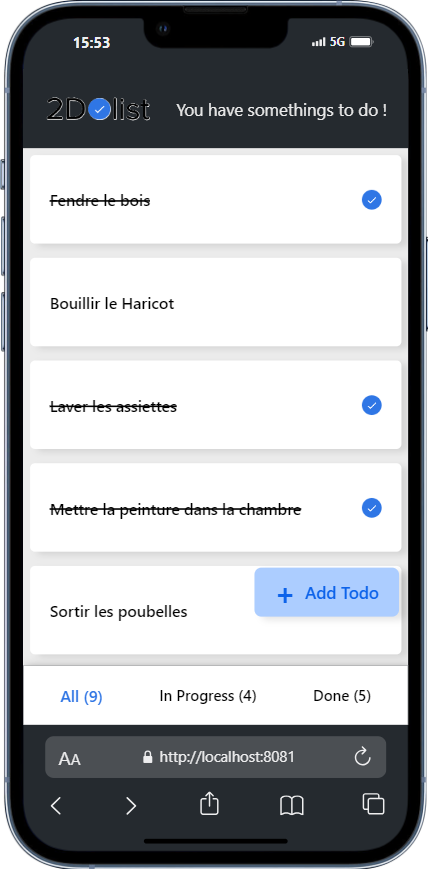
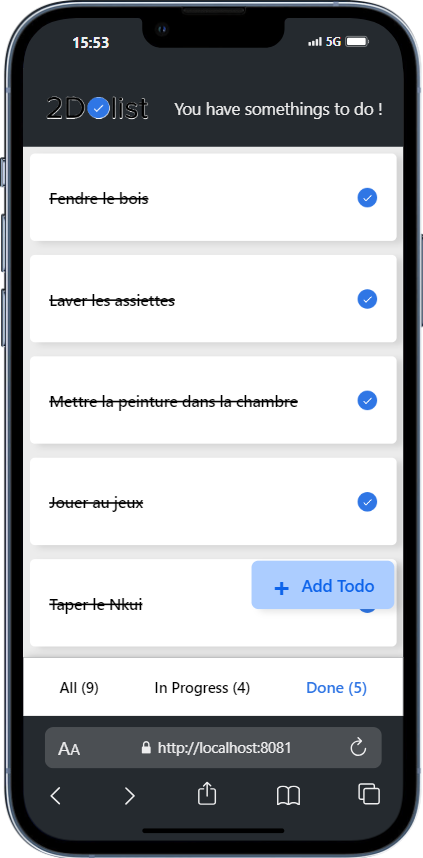

# TodoList App

Bienvenue dans l'application TodoList construite avec React Native. Cette application permet de gérer une liste de tâches avec des fonctionnalités telles que l'ajout de nouvelles tâches, le filtrage des tâches existantes et la suppression de tâches.

## Fonctionnalités

- **Ajout de Tâches** : Permet d'ajouter de nouvelles tâches à la liste.
- **Filtrage des Tâches** : Permet de filtrer les tâches par différents critères (par exemple, toutes les tâches, tâches complétées, tâches non complétées).
- **Suppression de Tâches** : Permet de supprimer des tâches de la liste.

## Prérequis

- [Node.js](https://nodejs.org/en/) (version 14 ou supérieure)
- [Expo CLI](https://expo.dev/tools#cli) (pour exécuter et tester l'application)

## Installation

1. Clonez ce dépôt sur votre machine locale :
   ```bash
   https://github.com/leskaiser/React---Native---Todolist.git


2. Accédez au répertoire du projet :
    ```bash
    cd React---Native---Todolist

3. Installez les dépendances :

    ```bash
    npm install

## Exécution de l'Application
Pour lancer l'application en mode développement, exécutez :

  ```bash
  npx expo start
```
Cela ouvrira Expo DevTools dans votre navigateur. Vous pouvez alors choisir d'exécuter l'application sur un émulateur, un simulateur ou un appareil physique en scannant le code QR avec l'application Expo Go.

## Demo


## Licence
Ce projet est sous licence MIT. Voir le fichier LICENSE pour plus de détails.

## Contact
Pour toute question ou suggestion, veuillez contacter [wanzoou@gmail.com](mailto:wanzoou@gmail.com).


## Merci d'utiliser l'application TodoList !😊 

